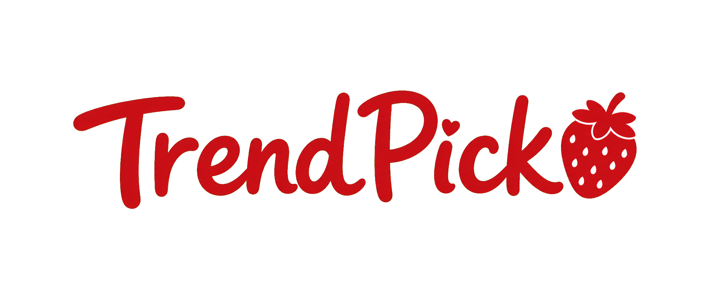

# TrendPick — 카페·베이커리 트렌드 큐레이션

> 사장님이 지금 뜨는 카페 트렌드를 빠르게 판단할 수 있도록, 검색·영상 데이터를 카드형 브리핑으로 정리하는 웹 서비스입니다.

## 문제 정의

카페·베이커리 사장님은 인스타그램, 블로그, 유튜브 등 여러 채널을 직접 확인해야 합니다. 정보가 흩어져 있어 지금 유행하는 메뉴인지, 이미 지나간 유행인지 판단하는 데 시간이 많이 듭니다.

## 해결 방법

- 디저트·음료·마케팅 트렌드를 한 화면에서 카드로 확인합니다.
- 검색량과 영상 언급량을 기반으로 태동기·상승기·전성기·하락기를 보여 줍니다.
- 상세 화면에서 검색량의 최근 변동과 트렌드가 뜨는 배경을 확인합니다.
- 관심 카테고리와 즐겨찾기를 저장해 사장님별로 브리핑을 관리합니다.

## 핵심 기능

| 기능 | 설명 |
| --- | --- |
| 홈 트렌드 브리핑 | 이번 주 HOT 트렌드와 TOP 10 랭킹 제공 |
| 카테고리 탐색 | 디저트, 음료, 마케팅/SNS별 트렌드 필터링 |
| 트렌드 상세 | 검색량 추이, 확산 지역, 상승 이유 제공 |
| 마이페이지 | 저장한 트렌드, 관심 분야, 매장 정보, 알림 설정 관리 |
| 관리자 큐레이션 | 트렌드·키워드 등록, 수집 및 발행 관리 |

## 기술 스택

- Frontend: Next.js, TypeScript, Tailwind CSS
- Backend: Node.js, Express, TypeScript
- Database/Auth/Storage: Supabase PostgreSQL, Supabase Auth, Supabase Storage
- Data: 네이버 데이터랩 API, YouTube Data API v3
- AI: OpenAI 이미지 생성 API

## 홍보 문구

**카페 트렌드, 한눈에 확인하세요.**  
매일 수집·분석한 데이터로 지금 뜨는 메뉴와 컨셉을 사장님에게 먼저 알려드립니다.

