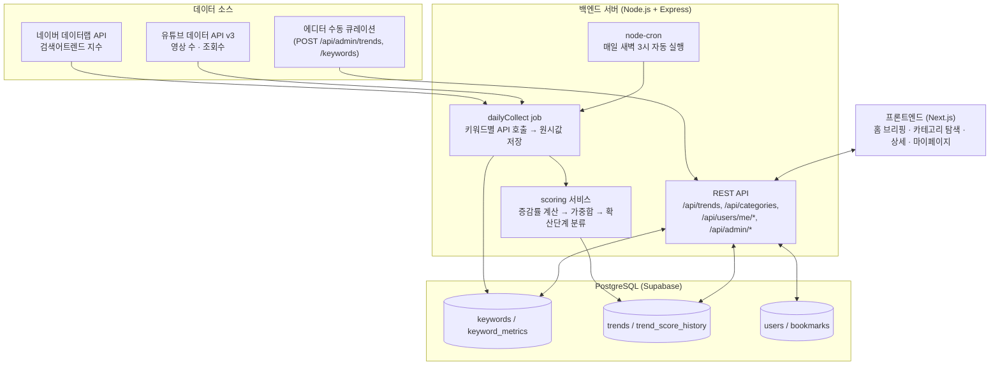

# zuki

카페·베이커리 트렌드 큐레이션 웹앱 **트렌드픽 (TrendPick)** — 자유 주제 팀 프로젝트 (2인 1팀)

---

## 팀원

| 이름 | 학교 | GitHub | 역할 |
|---|---|---|---|
| 김규민 | KAIST | https://github.com/rbalskim | 백엔드 |
| 안소희 | 부산대학교 | https://github.com/soheean1370 | 프론트엔드 |

---

## 기획안

- **산출물 주제:** 카페·베이커리 트렌드 큐레이션 웹앱 **트렌드픽 (TrendPick)**
- **제작 목적:** 카페·베이커리 사장님들은 트렌드에 뒤처지지 않으려 인스타그램을 뒤지지만, 팔로우할 계정이 너무 많고 무엇이 "진짜 트렌드"인지 알고리즘 속에서 판단하기 어렵다. 릴스·해시태그 같은 익숙하지 않은 인터페이스로 정보를 탐색하는 것 자체가 피로하고, 트렌드를 알아도 유행이 지난 뒤에야 알게 되는 경우가 많다. 트렌드픽은 이 정보를 **대신 수집·정리·해석**해서, 사장님이 "볼 것만 보고 바로 판단"할 수 있게 만드는 걸 목표로 한다.
- **핵심 구현 요소:**

    **[홈 / 트렌드 브리핑]**
    - 이번 주 뜨는 디저트·음료·마케팅 카드 뉴스
    - 트렌드별 확산 단계 표시: 태동기 → 상승기 → 전성기 → 하락기
    - 3줄 이내 요약 우선, 카드형 콘텐츠

    **[트렌드 예측]**
    - 검색량·영상 언급량 증가 추이 기반 "다음 달 뜰 것 같은" 항목 선제 안내
    - "왜 뜨는지" 배경 설명 (계절, 해외 유행 유입, 유명인 노출 등)

    **[카테고리 탐색]**
    - 디저트(빵류 포함) / 음료 / 마케팅 3개 카테고리별 필터링

    **[즐겨찾기 / 관심 카테고리]**
    - 마음에 드는 트렌드 카드 즐겨찾기
    - 관심 카테고리 설정해서 홈 피드 커스터마이징

    **[관리자 / 에디터 큐레이션]**
    - 트렌드 카드 수동 등록·발행, 키워드 등록 및 수집 대상 지정
    - 네이버 데이터랩·유튜브 API 데이터 + 에디터 판단을 합쳐 트렌드 점수 산출

- **사용 시나리오:**
  - **김미경 사장님 — 동네 개인 카페 8년 차 운영자 (52세)**
    - 상황: 카카오톡, 인스타그램 피드 보기는 가능하나 릴스·해시태그 탐색은 서툼. 최근 프랜차이즈·신상 카페에 손님을 뺏기는 느낌을 받는 중
    - Pain Point: 정보는 많은데 정리가 안 되고, 유행이 지나서야 알게 됨. 나름 트렌드를 따라가려 노력하지만 그 과정에서 심리적 부담과 스트레스를 많이 느낌
    - 원하는 것: "지금 뭐가 유행인지 한눈에" 확인하고 싶음. 다만 매장에 어떻게 적용할지는 본인이 직접 판단하고 싶어함(→ 그래서 매장 맞춤 추천·적용 가이드 기능은 의도적으로 제외, "유행 정보 제공"까지만 서비스 범위로 한정)
      → 홈 브리핑 + 트렌드 예측 + 카테고리 탐색 기능의 핵심 사용자

- **팀원별 역할:**
  - 김규민: 백엔드 개발, API 연동·데이터 수집 배치
  - 안소희: 기획/UX 설계, 프론트엔드 개발

### 개발 일정 (7일 스프린트)

| Day | 목표 |
|---|---|
| Day 1 | 기획 확정, DB 스키마 설계, 네이버/유튜브 API 키 발급, 프로젝트 초기 세팅 |
| Day 2 | 백엔드 API 골격 구현, 네이버/유튜브 API 연동 스크립트 개발 |
| Day 3 | 데이터 수집 배치 완성 + 트렌드 스코어링 로직 구현 |
| Day 4 | 프론트엔드 홈/카테고리 화면 개발, 백엔드 API 연결 |
| Day 5 | 프론트엔드 트렌드 상세/마이페이지 화면 개발, 관리자(Admin) 최소 기능 구현 |
| Day 6 | 통합 테스트, 버그 수정, 배포 |
| Day 7 | 최종 점검, 발표 자료·시연 시나리오 준비 |

---

## 구현 명세서

| 구현 요소 | 설명 | 우선순위 |
|---|---|---|
| 홈 트렌드 브리핑 | 발행된 트렌드를 카드 리스트로 표시, 확산 단계 라벨 포함 | 필수 |
| 카테고리 탐색 | 디저트/음료/마케팅별 필터링 | 필수 |
| 트렌드 상세 | 검색량 추이 그래프 + "왜 뜨는지" 배경 설명 | 필수 |
| 즐겨찾기 | 트렌드 카드 저장/해제 | 필수 |
| 네이버 데이터랩 연동 | 키워드 검색어트렌드 지수 수집 | 필수 |
| 유튜브 데이터 API 연동 | 키워드 관련 영상 수·조회수 수집 | 필수 |
| 트렌드 스코어링 | 네이버·유튜브 증감률 + 에디터 가중치 기반 점수 계산, 확산 단계 자동 분류 | 필수 |
| 수집 배치 자동화 | 매일 새벽 3시 자동 수집 (node-cron) | 필수 |
| 관리자 API (트렌드/키워드 등록) | 에디터가 트렌드 카드·수집 대상 키워드 직접 등록 | 필수 |
| 관심 카테고리 설정 | 사용자별 관심 카테고리 등록, 홈 피드 커스터마이징 | 선택 |
| 트렌드 예측 | 상승 조짐 있는 트렌드 사전 안내 | 선택 |
| 지역별 트렌드 확산 정보 | 트렌드별 주요 확산 지역 태깅 | 선택 |
| 사용자 제보/투표 | "우리 동네에도 뜨나요?" 피드백 수집 | 선택 |
| 관리자 전용 화면(UI) | 지금은 API 직접 호출로 대체, 별도 화면 개발 여부 미정 | 선택 |
| Supabase Auth 로그인 | 지금은 `x-user-id` 헤더로 임시 인증 중 | 선택 |
| 프리미엄 구독/제휴 발주 | 3단계 이후 비즈니스 모델 | 선택 |

---

## 아키텍처

### 데이터 파이프라인 구조도



- 배치(`dailyCollect`)가 외부 API에서 원시 데이터를 가져와 `keyword_metrics`에 쌓고, 스코어링 로직이 증감률을 계산해 `trends.score`/`trend_score_history`를 갱신한다.
- 프론트엔드는 가공이 끝난 결과(`/api/trends` 등)만 조회한다 — 외부 API를 직접 호출하지 않아 네이버·유튜브 API 할당량을 절약한다.
- 스코어링은 통계·ML 모델 대신 단순 가중합(`네이버 증감률×0.5 + 유튜브 증감률×0.3 + 에디터×0.2`)을 쓴다. 초기 데이터가 적은 상태에서 복잡한 모델은 오히려 부정확해지기 쉽고, "왜 이 등급인지" 설명 가능해야 한다는 판단.

---

## 설계 문서

### 화면 / 인터페이스 설계

<!-- 프론트엔드 화면 설계/Figma 링크는 안소희님이 채워주세요 -->
(작성 예정)

### 데이터 구조

**트렌드픽 DB ERD**

```mermaid
erDiagram
  CATEGORIES {
    smallint id PK
    string name
    string slug
  }
  USERS {
    uuid id PK
    string email
    string store_name
    string region_gu
    enum role
  }
  USER_CATEGORY_INTERESTS {
    uuid user_id PK_FK
    smallint category_id PK_FK
  }
  TRENDS {
    bigint id PK
    string title
    smallint category_id FK
    enum status
    numeric score
    uuid created_by FK
    boolean is_published
  }
  KEYWORDS {
    bigint id PK
    bigint trend_id FK
    string keyword
  }
  KEYWORD_METRICS {
    bigint id PK
    bigint keyword_id FK
    enum source_type
    string metric_type
    numeric value
    date collected_date
  }
  TREND_SCORE_HISTORY {
    bigint id PK
    bigint trend_id FK
    numeric score
    date recorded_date
  }
  BOOKMARKS {
    uuid user_id PK_FK
    bigint trend_id PK_FK
  }
  TREND_FEEDBACK {
    bigint id PK
    bigint trend_id FK
    uuid user_id FK
    boolean is_relevant
  }

  CATEGORIES ||--o{ TRENDS : has
  CATEGORIES ||--o{ USER_CATEGORY_INTERESTS : has
  USERS ||--o{ USER_CATEGORY_INTERESTS : has
  USERS o|--o{ TRENDS : creates
  USERS ||--o{ BOOKMARKS : has
  TRENDS ||--o{ BOOKMARKS : has
  TRENDS o|--o{ KEYWORDS : has
  KEYWORDS ||--o{ KEYWORD_METRICS : has
  TRENDS ||--o{ TREND_SCORE_HISTORY : has
  TRENDS ||--o{ TREND_FEEDBACK : receives
  USERS ||--o{ TREND_FEEDBACK : gives
```



전체 DDL: [`backend/src/db/schema.sql`](./backend/src/db/schema.sql)

### API / 외부 서비스 연동

| Method | Endpoint | 설명 | 요청 | 응답 |
|---|---|---|---|---|
| GET | `/health` | 헬스체크 | - | `{ status, service, time }` |
| GET | `/api/categories` | 카테고리 목록 | - | `{ categories: [...] }` |
| GET | `/api/trends` | 발행된 트렌드 목록 | 쿼리 `category`, `status`, `limit` | `{ trends: [...] }` |
| GET | `/api/trends/:id` | 트렌드 상세 + 스코어 추이 | - | `{ trend, scoreHistory }` |
| GET | `/api/users/me/bookmarks` | 즐겨찾기 목록 | Header `x-user-id` | `{ bookmarks: [...] }` |
| POST | `/api/users/me/bookmarks/:trendId` | 즐겨찾기 추가 | Header `x-user-id` | `{ ok: true }` |
| DELETE | `/api/users/me/bookmarks/:trendId` | 즐겨찾기 해제 | Header `x-user-id` | `204` |
| PUT | `/api/users/me/category-interests` | 관심 카테고리 설정 | `{ categoryIds: number[] }` | `{ ok, categoryIds }` |
| POST | `/api/admin/trends` | 트렌드 카드 생성(초안) | `{ title, categoryId, summary?, reason?, ... }` | `{ trend }` |
| PATCH | `/api/admin/trends/:id/publish` | 트렌드 발행 | - | `{ trend }` |
| POST | `/api/admin/keywords` | 키워드 등록/트렌드 연결 | `{ keyword, trendId? }` | `{ keyword }` |
| GET | `/api/admin/keywords` | 키워드 목록 | - | `{ keywords: [...] }` |
| POST | `/api/admin/collect` | 수집 배치 즉시 실행 | - | `{ summary }` |
| REST (외부) | 네이버 데이터랩 검색어트렌드 API | 키워드 검색량 상대지수(0~100) 조회, 최대 5그룹×20개 검색어 | `X-Naver-Client-Id/Secret` 헤더 | 기간별 지수 시계열 |
| REST (외부) | 유튜브 데이터 API v3 (`search.list`, `videos.list`) | 키워드 관련 영상 수·조회수 조회. 일일 10,000 unit 한도(`search.list` 100 unit) | API Key 쿼리 파라미터 | 영상 목록/통계 |

요청/응답 예시 전체: [`backend/API.md`](./backend/API.md)

---

## 산출물 및 실행 방법

- **산출물 설명:** 카페·베이커리 사장님을 위한 트렌드 큐레이션 웹앱. Next.js 프론트엔드 + Express 백엔드 + Supabase(PostgreSQL) 구성.
- **실행 환경:** 웹 브라우저 (반응형, 모바일/PC 대응). 백엔드는 Node.js 서버.
- **배포:** (예정 — Render/Railway 백엔드, Vercel 프론트엔드)

### 실행 방법

레포는 `frontend`(Next.js) · `backend`(Express) 2개로 구성되어 있어 각자 의존성을 설치하고 실행해야 한다.

```bash
# 1) 백엔드 (backend/)
cd backend
npm install
cp ../.env.example .env   # 값 채워넣기: DATABASE_URL, NAVER_CLIENT_ID/SECRET, YOUTUBE_API_KEY
npm run dev                # http://localhost:4000

# DB 스키마 적용 (최초 1회, Supabase 프로젝트 기준)
psql "$DATABASE_URL" -f backend/src/db/schema.sql

# 2) 프론트엔드 (frontend/)
cd frontend
npm install
npm run dev                # http://localhost:3000
```

> `.env`는 `backend/.env`에 실제 값을 넣어야 한다 — `.env.example`은 git에 커밋되는 템플릿이라 실제 키/비밀번호를 넣으면 안 됨.
> Supabase 무료 티어는 direct connection이 IPv6 전용이라, `DATABASE_URL`은 대시보드 Connect → **Session pooler** 연결 문자열을 사용해야 함.

### 기술 구성

| 분류 | 사용 기술 |
|---|---|
| 프론트엔드 | Next.js(React), TypeScript, Tailwind CSS, React Query + Zustand |
| 백엔드 | Node.js, Express, TypeScript |
| 데이터베이스 | PostgreSQL (Supabase) |
| 배치/스케줄링 | node-cron |
| 외부 API | 네이버 데이터랩 검색어트렌드 API, 유튜브 데이터 API v3 |
| 배포(예정) | Vercel(프론트), Render/Railway(백엔드), Supabase(DB) |

---

## 회고 문서

> 프로젝트 진행 중 — 스프린트 종료 후 KPT로 작성 예정

### Keep

(작성 예정)

### Problem

(작성 예정)

### Try

(작성 예정)

### 팀원별 소감

**김규민:**

> (작성 예정)

**안소희:**

> (작성 예정)

---

## 참고 자료

- [네이버 개발자센터 — 데이터랩 API](https://developers.naver.com)
- [YouTube Data API v3 문서](https://developers.google.com/youtube/v3)
- [Supabase — Connect to your database](https://supabase.com/docs/guides/database/connecting-to-postgres)
