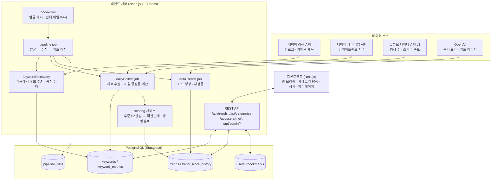
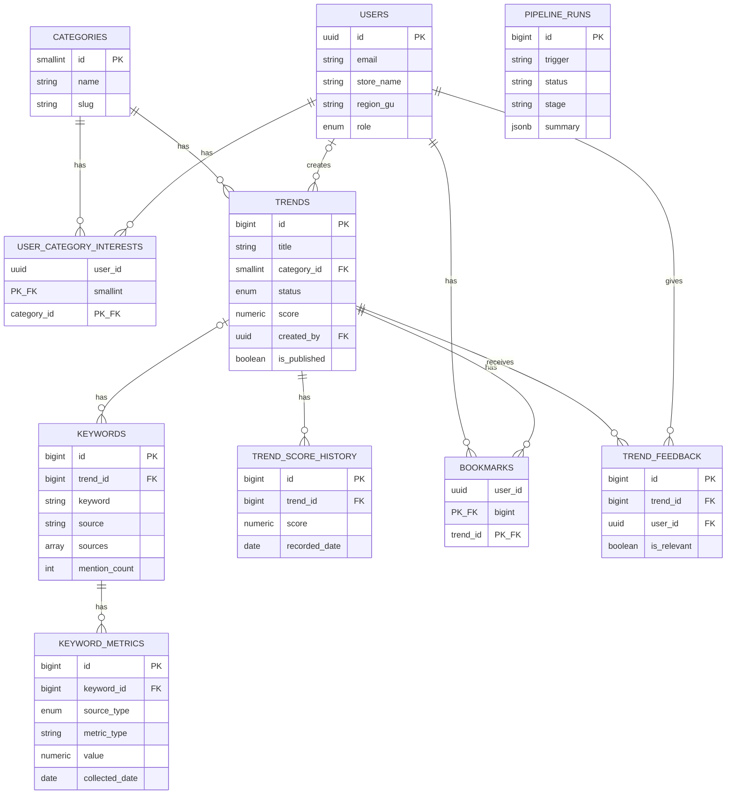

# zuki

카페·베이커리 트렌드 큐레이션 웹앱 **트렌드픽 (TrendPick)** — 자유 주제 팀 프로젝트 (2인 1팀)

---

## 팀원

| 이름 | 학교 | GitHub | 역할 |
|---|---|---|---|
| 김규민 | KAIST | https://github.com/rbalskim | 백엔드 |
| 안소희 | 부산대학교 | https://github.com/soheean1370 | 프론트엔드 |

---

## 기획안

- **산출물 주제:** 카페·베이커리 트렌드 큐레이션 웹앱 **트렌드픽 (TrendPick)**
- **제작 목적:** 카페·베이커리 사장님들은 트렌드에 뒤처지지 않으려 인스타그램을 뒤지지만, 팔로우할 계정이 너무 많고 무엇이 "진짜 트렌드"인지 알고리즘 속에서 판단하기 어렵다. 릴스·해시태그 같은 익숙하지 않은 인터페이스로 정보를 탐색하는 것 자체가 피로하고, 트렌드를 알아도 유행이 지난 뒤에야 알게 되는 경우가 많다. 트렌드픽은 이 정보를 **대신 수집·정리·해석**해서, 사장님이 "볼 것만 보고 바로 판단"할 수 있게 만드는 걸 목표로 한다.
- **핵심 구현 요소:**

    **[홈 / 트렌드 브리핑]**
    - 이번 주 뜨는 디저트·음료·마케팅 카드 뉴스
    - 트렌드별 확산 단계 표시: 태동기 → 상승기 → 전성기 → 하락기
    - 3줄 이내 요약 우선, 카드형 콘텐츠

    **[트렌드 예측]**
    - 검색량·영상 언급량 증가 추이 기반 "다음 달 뜰 것 같은" 항목 선제 안내
    - "왜 뜨는지" 배경 설명 (계절, 해외 유행 유입, 유명인 노출 등)

    **[카테고리 탐색]**
    - 디저트(빵류 포함) / 음료 / 마케팅 3개 카테고리별 필터링

    **[즐겨찾기 / 관심 카테고리]**
    - 마음에 드는 트렌드 카드 즐겨찾기
    - 관심 카테고리 설정해서 홈 피드 커스터마이징

    **[관리자 / 에디터 큐레이션]**
    - 트렌드 카드 수동 등록·발행, 키워드 등록 및 수집 대상 지정
    - 네이버 데이터랩·유튜브 API 데이터 + 에디터 판단을 합쳐 트렌드 점수 산출

- **사용 시나리오:**
  - **김미경 사장님 — 동네 개인 카페 8년 차 운영자 (52세)**
    - 상황: 카카오톡, 인스타그램 피드 보기는 가능하나 릴스·해시태그 탐색은 서툼. 최근 프랜차이즈·신상 카페에 손님을 뺏기는 느낌을 받는 중
    - Pain Point: 정보는 많은데 정리가 안 되고, 유행이 지나서야 알게 됨. 나름 트렌드를 따라가려 노력하지만 그 과정에서 심리적 부담과 스트레스를 많이 느낌
    - 원하는 것: "지금 뭐가 유행인지 한눈에" 확인하고 싶음. 다만 매장에 어떻게 적용할지는 본인이 직접 판단하고 싶어함(→ 그래서 매장 맞춤 추천·적용 가이드 기능은 의도적으로 제외, "유행 정보 제공"까지만 서비스 범위로 한정)
      → 홈 브리핑 + 트렌드 예측 + 카테고리 탐색 기능의 핵심 사용자

- **팀원별 역할:**
  - 김규민: 백엔드 개발, API 연동·데이터 수집 배치
  - 안소희: 기획/UX 설계, 프론트엔드 개발

### 개발 일정 (7일 스프린트)

| Day | 목표 |
|---|---|
| Day 1 | 기획 확정, DB 스키마 설계, 네이버/유튜브 API 키 발급, 프로젝트 초기 세팅 |
| Day 2 | 백엔드 API 골격 구현, 네이버/유튜브 API 연동 스크립트 개발 |
| Day 3 | 데이터 수집 배치 완성 + 트렌드 스코어링 로직 구현 |
| Day 4 | 프론트엔드 홈/카테고리 화면 개발, 백엔드 API 연결 |
| Day 5 | 프론트엔드 트렌드 상세/마이페이지 화면 개발, 관리자(Admin) 최소 기능 구현 |
| Day 6 | 통합 테스트, 버그 수정, 배포 |
| Day 7 | 최종 점검, 발표 자료·시연 시나리오 준비 |

---

## 구현 명세서

| 구현 요소 | 설명 | 우선순위 |
|---|---|---|
| 홈 트렌드 브리핑 | 발행된 트렌드를 카드 리스트로 표시, 확산 단계 라벨 포함 | 필수 |
| 카테고리 탐색 | 디저트/음료/마케팅별 필터링 | 필수 |
| 트렌드 상세 | 검색량 추이 그래프 + "왜 뜨는지" 배경 설명 | 필수 |
| 즐겨찾기 | 트렌드 카드 저장/해제 | 필수 |
| 네이버 데이터랩 연동 | 키워드 검색어트렌드 지수 수집 | 필수 |
| 유튜브 데이터 API 연동 | 키워드 관련 영상 수·조회수 수집 | 필수 |
| 트렌드 스코어링 | 검색지수(수준) + 28일 증감률(모멘텀) 2차원으로 점수·확산 단계 자동 분류 | 필수 |
| 키워드 발굴 | 네이버 블로그·카페·유튜브 제목에서 후보 자동 추출, 교차검증·품질 필터 | 필수 |
| 파이프라인 자동화 | 발굴(매시) → 수집·카드 갱신(매일 04시), node-cron + 외부 헬스핑 | 필수 |
| 카드 자동 생성 | 실제 게시물을 근거로 문구 생성, 상위 카드는 AI 이미지까지 | 필수 |
| 관리자 API (파이프라인/키워드) | 파이프라인 수동 실행, 감시 키워드 등록 | 필수 |
| Supabase Auth 로그인 | 이메일 + 카카오 소셜 로그인, ES256 JWKS 검증 | 필수 |
| 관심 카테고리 설정 | 사용자별 관심 카테고리 등록, 홈 피드 커스터마이징 | 선택 |
| 지난 유행 발굴 | 회고 검색어를 정확도순으로 훑어 과거 유행 키워드 확보 | 선택 |
| 트렌드 예측 | 상승 조짐 있는 트렌드 사전 안내 | 선택 |
| 지역별 트렌드 확산 정보 | 트렌드별 주요 확산 지역 태깅 | 선택 |
| 사용자 제보/투표 | "우리 동네에도 뜨나요?" 피드백 수집 | 선택 |
| 관리자 전용 화면(UI) | 백엔드 데모 페이지(`/demo.html`)에서 파이프라인 실행·상태 확인 | 선택 |
| 프리미엄 구독/제휴 발주 | 3단계 이후 비즈니스 모델 | 선택 |

---

## 아키텍처

### 데이터 파이프라인 구조도



**파이프라인은 세 단계가 한 흐름이다.** 발굴이 후보를 찾고, 수집이 지표를 채우고, 카드 갱신이 화면에 나갈 카드를 만든다. 순서가 있어서 따로 실행하면(수집 전에 갱신 등) 결과가 빈다. 그래서 `jobs/pipeline.ts` 한 곳에서 관리하고, 실행 이력은 `pipeline_runs`에 남긴다 — 상태를 프로세스 메모리에만 두면 재배포·슬립 때마다 사라져서 "방금 뭐가 돌았는지"를 알 수 없기 때문이다.

**수집은 2단계로 나뉜다** — 유튜브 할당량이 네이버보다 훨씬 빡빡하기 때문:

| 단계 | 대상 | 사용 API | 한도 |
|---|---|---|---|
| 넓게 감시 | 후보 키워드 전체 | 네이버만 (5개씩 묶음 호출) | 하루 5,000개까지 가능 |
| 깊게 추적 | 트렌드 카드에 연결된 키워드 | 네이버 + 유튜브 | 하루 60개 (키워드당 101 unit) |

후보 키워드는 검색량만 봐도 "뜨는지"는 충분히 판단되므로, 비싼 유튜브 호출은 실제 카드로 만든 것에만 쓴다.

**후보 키워드는 어디서 오나** — 네이버 데이터랩은 "이 키워드가 얼마나 뜨나?"에만 답하고 "뭐가 뜨나?"는 알려주지 않는다. 키워드를 먼저 줘야 지수를 돌려주는 구조이고, 급상승 키워드 목록 API도 없다(실시간 검색어는 2021년 폐지). 그래서 **지금 실제로 올라오고 있는 콘텐츠를 읽어** 후보를 찾아내는 발굴 단계(`POST /api/admin/keywords/discover`)를 별도로 둔다:

1. **네이버 블로그** 최신 포스트 제목
2. **네이버 카페글** 최신 포스트 제목
3. **유튜브 주제 검색** — 최근 30일 영상을 조회수 속도 순으로

검색어는 `카페 신메뉴`, `요즘 유행 디저트`, **`편의점 신메뉴`** 등 21개다. 편의점을 포함하는 이유는 국내 디저트·음료 유행이 편의점에서 먼저 터지고 카페로 넘어오는 경우가 많기 때문이다(두바이초콜릿이 대표적). 카페 쪽만 보면 이미 확산된 뒤에야 잡힌다. 마케팅은 어휘 체계가 완전히 달라서(`굿즈`, `콜라보`, `스탬프 적립`) 따로 검색해야 잡힌다.

**자주 돌리는 것보다 깊게 파는 게 낫다.** 초기엔 쿼리당 최신 100건만 봤는데, 블로그 글이 쌓이는 속도보다 발굴 주기가 빨라서 매번 같은 글을 다시 읽었다(실측: 후보 144개 중 신규 1개). 지금은 쿼리당 **5페이지(500건)**까지 훑는다. 각 소스에서 더 많은 제목을 보면 교차검증 통과율도 함께 오른다.

### 지난 유행은 검색 방식을 바꿔야 잡힌다

위 발굴은 전부 최신순(`sort=date`)이라 **구조적으로 지금 뜨는 것만 잡힌다.** 흑당버블티는 지금 아무도 글을 안 쓰니까, 회고 검색어를 넣어도 "최근에 올라온 회고글"만 걸린다.

그래서 아카이브 모드를 따로 뒀다. 회고 검색어 32개(`유행 지난 디저트`, `2022 유행 디저트`, `추억의 음료`, `한물간 디저트`…)를 **정확도순(`sort=sim`)으로 10페이지까지** 훑어, 3년 전 글이든 상관없이 그 주제에 가장 맞는 글을 가져온다. 사람들이 "그때 뭐가 유행했었지" 하고 정리해둔 글에서 과거 키워드를 얻고, 그것들은 수집 후 검색량이 낮게 나와 하락기 카드가 된다. 유튜브는 최근 30일만 보므로 이 모드에서는 쓰지 않는다.

### 교차 검증 — 편향을 어떻게 다루나

**어떤 발굴 소스도 편향이 있다.** 네이버 블로그는 체험단·협찬 포스팅이 많고, 카페글은 카페마다 연령대가 갈리며, 유튜브는 채널 구독자층이 다르다. 특정 유튜버를 골라 넣는 방식은 고르는 사람의 취향까지 더해져 더 나쁘다.

그래서 두 가지로 완화한다:

**1. 세 소스를 각각 훑고, 몇 곳에서 잡혔는지 센다.** 한 곳에서만 나온 키워드는 그 소스의 편향일 수 있고, 여러 곳에서 동시에 나오면 실제 트렌드일 확률이 높다. 개인 카페·빵집 이름(`천하제빵`, `미켈란젤라또`)이 대개 블로그 한 곳에서만 나온다는 점에서, 이 방식은 가게 이름 노이즈도 함께 걸러준다.

**2. 유튜브는 채널을 고정하지 않는다.** 매번 주제 검색으로 "지금 이 주제에서 조회수가 잘 나오는 영상"을 찾으면 영향력 있는 채널이 자연스럽게 뽑히고, 유행이 바뀌면 구성도 알아서 바뀐다.

구조상 소스 편향이 덜 치명적인 이유도 있다. 발굴은 후보를 찾는 단계일 뿐이고 **최종 판단은 검색량이 한다.** 편향된 소스에서 나온 후보라도 사람들이 실제로 검색하지 않으면 걸러진다. 즉 소스 편향은 "틀린 걸 올리는" 위험보다 "있는 걸 놓치는" 위험을 만든다.

남는 한계는 인정한다 — 우리 소스 대부분이 30~50대 중심이라 20대에서 먼저 뜨는 트렌드는 늦게 잡히고, 수도권 콘텐츠가 많으며, 협찬 포스팅을 완전히 걸러내지는 못한다.

### 조회수는 절대값이 아니라 속도로 본다

```
영상 A: 100만 조회 / 3년 전 업로드  ->  하루 900회
영상 B:   5만 조회 / 5일 전 업로드  ->  하루 1만회   <- 이게 지금 유행
```

`order=viewCount`로만 뽑으면 A가 1등이 되어 "역대 인기"를 재게 된다. `publishedAfter`로 최근 30일 영상만 대상으로 삼고 `조회수 / 업로드 후 경과일`을 계산해야 현재 열기를 잰다.

두 소스 모두 제목에서 "라떼·케이크·크루아상 등으로 끝나는 단어"를 골라내되, **등장 횟수를 함께 센다.** 단순히 중복 제거만 하면 제목 1000개에서 30번 나온 `두바이초콜릿`과 1번 나온 `식빵`이 똑같이 후보 1개가 되어, 결과가 "요즘 화제"가 아니라 "어디에나 있는 메뉴 목록"이 되어버린다.

추출 과정에서 걸러내는 것들 — **전부 실제로 카드까지 만들어졌던 것들이다.**

| 규칙 | 실제로 걸린 것 |
|---|---|
| **형태 단어 단독** | `빙수`, `말차`, `아메리카노` — "빙수가 뜬다"는 사장님이 쓸 수 없는 정보다. "망고빙수가 뜬다"여야 행동으로 이어진다 |
| **수식어 + 형태** | `신상아이스크림`, `건강빵` — 어떤 아이스크림인지 모르니 할 수 있는 게 없다 |
| **숫자로 시작** | `120겹파이` — 제품 스펙 표기지 메뉴 이름이 아니다 |
| **지역명 접두** | `창원소금빵` → `소금빵`으로 정규화, `서울빵`은 버림 |
| **비(非)디저트 어미** | `게티`(돼지게티=라면), `시티`(마티에부산하버시티=호텔), `도시락`, `라면` |
| **브랜드·가게 이름** | `이삭토스트`, `던킨도넛`, `아임도넛`, `텐라떼`(텐퍼센트커피), `콩지니빵`(부산 가게) |
| **식품 유형 명칭** | `준초콜릿` — 카카오 함량 낮은 초콜릿의 법적 분류명. 홈베이킹 글에 대량 등장 |
| **광고 상투어** | `무료체험`, `경품이벤트`, `현금챌린지`(재테크 유행) |

**한 글자 어미는 규칙으로 못 막는다.** `티`가 그랬다. `돼지게티`·`마티에부산하버시티`·`핏제리아디토티` 모두 "앞말 2자 이상" 규칙을 훌쩍 통과했다. 그래서 `티`를 형태 단어에서 빼고 `밀크티`·`블랙티`처럼 차를 가리키는 게 확실한 조합만 남겼다. `파이`도 같은 문제라 `스포티파이`·`와이파이`를 따로 막았다.

**프랜차이즈는 교차검증으로 못 거른다.** 오히려 유명할수록 블로그·카페 양쪽에서 언급되어 잘 통과한다. 이름 목록으로 막는 수밖에 없어서, 눈에 띌 때마다 추가하는 운영 방식을 택했다.

**필터는 발굴·카드 생성·재검증 세 곳 모두에 건다.** 처음엔 발굴 시점에만 걸었는데, 그러면 규칙을 고쳐도 이미 DB에 있던 키워드는 그대로 카드가 됐다. 카드 갱신 때 전체를 다시 검사하도록 고쳤지만 그것만으로도 부족했다 — 재검증이 실행 **시작 시점**에 돌고 생성 루프가 그 뒤에 돌아서, 방금 내린 카드를 같은 실행에서 다시 만들었다(`아임도넛`이 계속 살아난 이유). 세 경로 모두에 걸어야 규칙 변경이 실제로 반영된다.

형태소 분석기 없이 처리하는 방식이라 정밀하진 않지만, 오탐이 나와도 다음 단계에서 검색량으로 다시 걸러진다.

**후보 순위는 변화의 크기로 매긴다.**

```
trend_signal = 변화 강도(방향 무관) 55점 + 검색지수 30점 + 교차검증 15점
```

**증감률을 절댓값으로 쓴다.** 부호를 그대로 쓰면 하락 중인 키워드가 항상 최하위로 깔려 "지난 유행" 카드가 만들어지지 않는다. 크게 오르든 크게 내리든 많이 움직인 것은 알릴 가치가 있고, 방향은 확산 단계가 표현한다. 덕분에 상승·하락 트랙을 따로 둘 필요가 없다.

검색지수를 정렬 기준에 넣으면 에그타르트·밀크티 같은 스테디셀러가 상위를 차지해 발굴이 되지 않는다. 검색지수가 높다는 건 이미 자리잡았다는 뜻이기 때문이다.

**언급 증가율에 더 무게를 두는 이유** — 새로 뜨는 메뉴는 검색량보다 블로그 게시가 먼저 늘어난다. 사람들이 검색하기 전에 글부터 올라오기 때문이다.

**언급 증가율은 어떻게 구하나** — 네이버 블로그 검색 응답에 `postdate`(게시 날짜)가 들어온다. 최신순으로 긁어 날짜별로 세면 일별 게시량이 나오고, `start` 파라미터로 최대 1,000개까지 거슬러 올라갈 수 있다. 덕분에 **과거 데이터를 쌓아두지 않아도 "최근 7일 대 그 이전 7일"을 오늘 바로 계산할 수 있다.**

### 계절성 필터는 넣었다가 뺐다

7월에 팥빙수 검색이 오르는 건 여름이라서지 트렌드가 아니다. 그래서 데이터랩을 `timeUnit=month`로 24개월치 조회해 작년 같은 달과 비교하고, 비슷한 수준이면 후보에서 제외했다.

**그런데 7월에 돌려보니 필터가 과했다.** 빙수·스무디·에이드 등 카페 여름 메뉴 전체가 "작년 여름에도 높았음"에 걸려 **후보 127개 중 107개가 지워졌다.** 카드가 3장밖에 안 나온 직접적 원인이었다.

판단을 바꾼 근거는 카드의 성격이다. 우리 카드는 "지금 새로 뜨는 것"만이 아니라 **감시 대상 전체의 카탈로그**다. 그 관점에서 "지금 빙수가 뜬다"는 계절성이어도 유의미하다 — 여름 신메뉴를 준비하라는 신호다. 계절이라고 숨길 이유가 없다.

필터를 뺀 뒤 **검사 자체도 제거했다.** 쓰지 않는 값인데 실행마다 데이터랩을 130회+ 소모했고, 검색지수 수집과 합쳐 일일 한도(1,000회)를 넘겨 **수집 전체가 실패했다**(실측: 네이버 0 / 실패 560). `is_seasonal`·`yoy_growth_rate` 컬럼과 기존 값은 카드 문구가 참조하므로 남겨뒀다.

**후보에서 걸러내는 조건 정리**

| 조건 | 이유 |
|---|---|
| 검색지수 5 미만 | 아무도 안 찾는 것. 정렬엔 안 쓰되 하한선은 둔다 |
| 검색지수 40+ & 검색 증감률 5% 미만 | 이미 자리잡은 상시 메뉴 |
| 언급 2회 미만 | 대부분 가게 이름이나 일회성 표현 |
| 소스 2곳 미만 | 교차검증 미통과 |
| 키워드 품질 규칙 미통과 | 위 표의 필터 |

에디터가 직접 등록한 키워드는 언급 횟수·교차검증을 면제한다. 이 조건들은 자동 발굴의 노이즈를 거르려는 장치이지, 사람이 "이건 감시해라"라고 지정한 것까지 막으라는 뜻이 아니다. 실제로 `두바이쫀득쿠키`는 표기가 40갈래로 쪼개져(`두쫀쿠키`/`두바이쫀뜩쿠키`/`군산두바이쫀득쿠키`…) 각각 언급 1~2회라 전부 탈락했다 — 합치면 큰 유행인데 **파편화로 신호가 흩어진** 경우라, 대표 표기를 사람이 지정해 해결한다.

**측정이 불가능하면 값을 만들어내지 않는다.** 언급 증가율은 14일 구간을 실제로 덮었고 표본이 10건 이상일 때만 낸다. 인기 키워드는 블로그 글 1,000건(API 상한)이 며칠치밖에 안 돼 이전 7일에 도달하지 못하는데, 그 경우 "무한 증가"처럼 보이지만 사실은 데이터가 없는 것이다. 글 5건으로 계산한 `+66.7%`도 노이즈다. 전년 대비도 작년 지수가 1 미만이면(`+116343%` 같은 값이 나온다) 계산하지 않는다.

> 초기엔 `재료 × 형태`(흑임자 + 라떼) 조합을 자동 생성했지만 폐기했다. 우리가 만들어낸 말은 대부분 아무도 검색하지 않고, 진짜 유행어(두바이초콜릿 같은)는 조합으로 예측할 수 없기 때문이다.

### 카드 생성 — 자동, 다만 지어내지 않는다

`POST /api/admin/pipeline`의 마지막 단계가 수집한 키워드를 **트렌드 카드로 자동 생성**한다.

**카드는 "지금 뜨는 것"이 아니라 감시 중인 디저트 전체의 카탈로그다.** 그 안에서 확산 단계로 나뉘고, 홈 화면은 `sort=score&limit=10`으로 상위 몇 개만 보여준다. 순위에서 밀렸다고 카드를 내리지 않는다 — 단계가 하락기로 바뀔 뿐이라 지난 유행을 계속 보여줄 수 있다.

**비용과 시간 때문에 2단계로 나눈다.** 카드마다 근거 수집(네이버 검색 2회) + LLM 문구 + AI 이미지를 돌리면 카드당 10~15초가 걸리고 이미지는 장당 과금된다. 수백 개를 한 요청에 처리하면 HTTP가 먼저 끊긴다.

| | 문구 | 이미지 | 속도 |
|---|---|---|---|
| 상위 15개 | 뉴스·블로그 근거 + LLM | AI 생성 | 카드당 10~15초, 과금 |
| 나머지 | 측정값 기반 | 없음 | 즉시, 무료 |

그리고 한 번에 다 만들지 않고 회차마다 상한(기본 60장)만큼만 만든다. 후보가 밀려 있으면 한 실행 안에서 남은 개수가 0이 될 때까지 최대 8회차를 이어 돌리되, **이미지는 첫 회차에만 생성한다** — 회차마다 상위 15장씩 새로 그리면 과금이 배로 든다.

**매 실행마다 기존 카드도 다시 검사한다.** 후보 조건은 새로 만들 카드만 거르기 때문에, 필터를 강화해도 그 전에 만들어진 카드는 화면에 남는다. 그래서 전체 자동 카드에 교차검증과 키워드 품질 규칙을 재적용해 실패한 건 내리고(`retired`), 다시 통과한 건 되살린다(`restored`). 삭제가 아니라 `is_published` 토글이라 다음 발굴에서 소스가 채워지면 카드가 저절로 돌아온다.

문구 자동 생성에는 환각 위험이 있다. "왜 뜨는지"를 LLM에게 자유롭게 맡기면 *"최근 일본 디저트 유행과 맞물려..."* 같은 그럴듯한 거짓말이 나오는데, 사장님이 이걸 근거로 메뉴를 결정하면 곤란하다.

그래서 **실제 게시물을 읽어와 그 안에 있는 내용만 쓰게 한다.** 키워드마다 네이버 뉴스·블로그를 검색해 제목과 본문 발췌를 모으고, LLM에는 그 자료와 우리가 측정한 수치만 준다. 뉴스에는 배경(신제품 출시, 화제성)이 적혀 있는 경우가 많아, LLM이 하는 일은 창작이 아니라 요약이 된다. 게시물에 원인이 없으면 추측하지 말고 지표만 서술하게 한다.

```
X "최근 일본 디저트 유행과 맞물려"        <- 아무 자료에도 없는 창작
O "편의점 3사가 이달 신제품으로 출시했고"  <- 뉴스 기사에 실제로 있는 내용
O "최근 7일 블로그 게시량이 2배 늘었습니다" <- 우리가 측정한 값
```

근거가 된 게시물 링크는 카드의 `evidence` 필드에 저장해 **사장님이 원문을 확인할 수 있게** 한다. 출처를 못 대는 정보는 트렌드 서비스에서 신뢰받을 수 없기 때문이다.

- 배치(`dailyCollect`)가 외부 API에서 원시 데이터를 가져와 `keyword_metrics`에 쌓고, 스코어링 로직이 증감률을 계산해 `trends.score`/`trend_score_history`를 갱신한다.
- 프론트엔드는 가공이 끝난 결과(`/api/trends` 등)만 조회한다 — 외부 API를 직접 호출하지 않아 네이버·유튜브 API 할당량을 절약한다.
**확산 단계는 수준 + 모멘텀 2차원으로 분류한다.**

| | 감소 (−15%↓) | 정체 | 급등 (+50%↑) | 측정 불가 |
|---|---|---|---|---|
| 검색지수 40 이상 | 하락기 | 전성기 | 상승기 | **상승기** |
| 검색지수 15~40 | 하락기 | 상승기 | 상승기 | **상승기** |
| 검색지수 5~15 | 하락기 | 태동기 | 태동기 | 태동기 |
| 검색지수 5 미만 | 태동기 | 태동기 | 태동기 | 태동기 |

**모멘텀을 모르면 전성기로 분류하지 않는다.** 증감률이 `null`인 건 "비교할 과거가 없다" = 최근에 처음 등장했다는 뜻이다. 그런데 규모만 보고 판정하면 `전성기`가 되는데, 전성기는 "이미 높은 수준에서 **정체**"라는 뜻이라 정반대다. 갓 등장해서 규모가 붙은 건 확산 중, 즉 상승기다.

증감률만으로 단계를 정하면 분류가 뒤집힌다 — 전성기는 원래 "이미 높은 수준에서 정체"라 증감률이 0에 가깝고, 태동기는 "밑바닥에서 시작"이라 증감률이 폭발적이기 때문이다. 검색지수 5→10인 무명 키워드가 +100%로 전성기가 되고, 80→90인 성숙 트렌드가 +12%로 태동기가 되는 식이다. 그래서 크기(수준)와 방향(모멘텀)을 함께 본다.

랭킹 점수는 이와 별개로 `검색지수 × 0.6 + 증감률(정규화) × 0.4`로 계산한다. 사장님이 알고 싶은 건 "비율상 많이 오른 것"이 아니라 "실제로 큰 유행"이므로 수준에 더 무게를 둔다.

### 증감률 — 반짝이 아니라 자리 잡는 유행을 잰다

하루 단위가 아니라 구간 평균끼리 비교한다. 카페 디저트 검색은 주말에 몰려서, 하루 비교는 월요일과 일요일을 견주게 되어 항상 급락처럼 보인다. 평균이 요일 효과와 하루짜리 이상치를 흡수한다.

**구간은 7일에서 28일로 바꿨다.** 7일 비교에는 두 가지 문제가 있었다:

- 방송 한 번에 튄 반짝 스파이크가 `+167%` 같은 값으로 최상위를 차지한다
- 3주 전부터 꾸준히 오르는 키워드는 최근 7일과 직전 7일이 **둘 다 높아서** 증감률이 밋밋하게 나온다 — 진짜 확산일수록 오히려 낮게 찍혔다

```
90일 꾸준한 상승  ->  7일 기준 +7%    /  28일 기준 +41%
5일짜리 스파이크  ->  7일 기준 +286%  /  28일 기준 +71%
```

우리가 찾는 건 반짝이 아니라 자리 잡아가는 유행이므로 28일이 맞다. 요일 효과도 4바퀴 돌아 안정적이고, 데이터랩이 90일 시계열을 통째로 주므로 추가 호출 없이 첫 수집부터 계산된다.

**구간은 배열이 아니라 날짜로 자른다.** 네이버는 검색량이 0인 날을 응답에서 빼버려서, 신상 키워드는 배열이 듬성듬성하다. 인덱스로 `slice(-28)`/`slice(-56,-28)`을 하면 `씬쿠키`(34일치)는 **"최근 28일 대 직전 6일"**을 비교하게 된다 — 기간이 다른 두 평균을 나눈 값이라 의미가 없다. `+167.7%`의 정체가 이것이었다. 달력 날짜로 구간을 잡고 빠진 날은 0으로 계산한다.

**측정할 수 없으면 값을 만들지 않는다.** 이전 28일에 실제 데이터가 14일 미만이면 증감률을 내지 않는다(`null`). 신상은 기준값이 0에 가까워 수백~수천 %가 찍히는데, 숫자는 크지만 "예전엔 아무도 안 찾았다"는 뜻일 뿐 트렌드 강도로 쓸 수 없다.

- 스코어링은 통계·ML 모델 대신 단순 규칙을 쓴다. 초기 데이터가 적은 상태에서 복잡한 모델은 오히려 부정확해지기 쉽고, 사장님 대상 서비스라 "왜 이 등급인지" 설명 가능해야 신뢰를 얻는다는 판단.

---

## 설계 문서

### 화면 / 인터페이스 설계

<!-- 프론트엔드 화면 설계/Figma 링크는 안소희님이 채워주세요 -->
(작성 예정)

### 데이터 구조

**트렌드픽 DB ERD**



전체 DDL: [`backend/src/db/schema.sql`](./backend/src/db/schema.sql)

### API / 외부 서비스 연동

| Method | Endpoint | 설명 | 요청 | 응답 |
|---|---|---|---|---|
| GET | `/health` | 헬스체크 | - | `{ status, service, time }` |
| GET | `/api/categories` | 카테고리 목록 | - | `{ categories: [...] }` |
| GET | `/api/trends` | 발행된 트렌드 목록 | 쿼리 `category`, `status`, `limit` | `{ trends: [...] }` |
| GET | `/api/trends/:id` | 트렌드 상세 + 검색량 추이(60일) | - | `{ trend, scoreHistory, searchIndexHistory }` |
| GET | `/api/users/me` | 내 프로필 | `Authorization: Bearer` | `{ user }` |
| GET | `/api/users/me/bookmarks` | 즐겨찾기 목록 | `Authorization: Bearer` | `{ bookmarks: [...] }` |
| POST | `/api/users/me/bookmarks/:trendId` | 즐겨찾기 추가 | `Authorization: Bearer` | `{ ok: true }` |
| DELETE | `/api/users/me/bookmarks/:trendId` | 즐겨찾기 해제 | `Authorization: Bearer` | `204` |
| PUT | `/api/users/me/category-interests` | 관심 카테고리 설정 | `{ categoryIds: number[] }` | `{ ok, categoryIds }` |
| POST | `/api/admin/pipeline` | 발굴 → 수집 → 카드 갱신 실행 | `{ discover?, youtube?, archive?, collect?, autoRefresh? }` | `202 { options }` |
| GET | `/api/admin/pipeline` | 실행 상태·직전 결과 | - | `{ running, lastRun }` |
| GET | `/api/admin/keywords/rising` | 급상승 후보 키워드 | 쿼리 `minIndex`, `minSources` 등 | `{ keywords: [...] }` |
| POST | `/api/admin/keywords` | 감시 키워드 등록 | `{ keyword, trendId? }` | `{ keyword }` |
| REST (외부) | 네이버 데이터랩 검색어트렌드 API | 키워드 검색량 상대지수(0~100) 조회, 호출당 최대 5그룹 | `X-Naver-Client-Id/Secret` 헤더 | 기간별 지수 시계열 |
| REST (외부) | 네이버 검색 API (블로그·카페글·뉴스) | 발굴용 제목 수집, 근거 게시물 조회. 일일 25,000회 | 동일 헤더 | 게시물 목록 |
| REST (외부) | 유튜브 데이터 API v3 (`search.list`, `videos.list`) | 키워드 관련 영상 수·조회수 조회. 일일 10,000 unit 한도(`search.list` 100 unit) | API Key 쿼리 파라미터 | 영상 목록/통계 |
| REST (외부) | OpenAI (`chat.completions`, `images.generate`) | 근거 기반 문구 요약, 카드·배너 이미지 생성 | Bearer API Key | 텍스트 / 이미지 |

요청/응답 예시 전체: [`backend/API.md`](./backend/API.md)

---

## 산출물 및 실행 방법

- **산출물 설명:** 카페·베이커리 사장님을 위한 트렌드 큐레이션 웹앱. Next.js 프론트엔드 + Express 백엔드 + Supabase(PostgreSQL) 구성.
- **실행 환경:** 웹 브라우저 (반응형, 모바일/PC 대응). 백엔드는 Node.js 서버.
- **배포:** Render(백엔드, 무료 플랜) + Supabase(DB) / Vercel(프론트엔드, 예정)

### 실행 방법

레포는 `frontend`(Next.js) · `backend`(Express) 2개로 구성되어 있어 각자 의존성을 설치하고 실행해야 한다.

```bash
# 1) 백엔드 (backend/)
cd backend
npm install
cp ../.env.example .env   # 값 채워넣기: DATABASE_URL, NAVER_CLIENT_ID/SECRET, YOUTUBE_API_KEY
npm run dev                # http://localhost:4000

# DB 스키마 적용 (최초 1회, Supabase 프로젝트 기준)
psql "$DATABASE_URL" -f backend/src/db/schema.sql

# 2) 프론트엔드 (frontend/)
cd frontend
npm install
npm run dev                # http://localhost:3000
```

> `.env`는 `backend/.env`에 실제 값을 넣어야 한다 — `.env.example`은 git에 커밋되는 템플릿이라 실제 키/비밀번호를 넣으면 안 됨.
> Supabase 무료 티어는 direct connection이 IPv6 전용이라, `DATABASE_URL`은 대시보드 Connect → **Session pooler** 연결 문자열을 사용해야 함.

### 배포 주소

| 대상 | 주소 |
|---|---|
| 백엔드 API | https://zuki-l2hu.onrender.com |
| 백엔드 데모 페이지 | https://zuki-l2hu.onrender.com/demo.html |
| 헬스체크 | https://zuki-l2hu.onrender.com/health |
| 프론트엔드 | (Vercel 배포 예정) |

프론트엔드는 `.env`에 `NEXT_PUBLIC_API_URL=https://zuki-l2hu.onrender.com`을 넣으면 배포된 백엔드에 붙는다.

### 백엔드 배포 (Render)

레포 루트의 [`render.yaml`](./render.yaml)에 설정이 들어있다. Render 대시보드에서 **New → Blueprint**로 이 레포를 연결하면 그대로 서비스가 만들어진다.

| 항목 | 값 |
|---|---|
| Root Directory | `backend` |
| Build Command | `npm ci && npm run build` |
| Start Command | `npm start` |
| Health Check Path | `/health` |
| Plan | Free |

**대시보드에서 직접 입력해야 하는 환경변수** (시크릿이라 `render.yaml`엔 값이 없음):

| 변수 | 설명 |
|---|---|
| `DATABASE_URL` | Supabase **Session pooler** 연결 문자열. 비밀번호의 특수문자는 URL 인코딩 필요 |
| `NAVER_CLIENT_ID` / `NAVER_CLIENT_SECRET` | 네이버 데이터랩 API |
| `YOUTUBE_API_KEY` | 유튜브 데이터 API v3 |
| `CORS_ORIGIN` | 프론트 배포 도메인 (예: `https://trendpick.vercel.app`). 미설정 시 전체 허용 |

배포 후 `https://<서비스명>.onrender.com/health`로 확인하고, 프론트의 API base URL을 이 주소로 바꾸면 된다.

> **무료 플랜 슬립 주의**
> 15분간 요청이 없으면 인스턴스가 잠들고, 다음 요청이 깨우는 데 약 1분 걸린다.
> 시연 중 첫 요청이 1분 대기하게 되므로, 발표 직전에 미리 한 번 열어두는 것이 좋다.

### 파이프라인 자동화

**발굴 → 수집 → 카드 갱신**은 순서가 있는 하나의 흐름이라 `jobs/pipeline.ts` 한 곳에서 관리한다.
`node-cron`으로 세 주기를 등록하며, 시간대는 `Asia/Seoul` 고정이다(Render 컨테이너는 UTC라 그냥 두면 새벽 작업이 오전에 돈다).

| 스케줄 | 기본 주기 | 하는 일 | 환경변수 |
|---|---|---|---|
| 가벼운 발굴 | 매시 15분 | 네이버 블로그·카페 | `DISCOVER_CRON` |
| 유튜브 포함 발굴 | 하루 2회 (09:30/20:30) | 위 + 유튜브 검색 | `DISCOVER_YOUTUBE_CRON` |
| 전체 실행 | 매일 04:00 | 발굴 + 수집 + 카드 갱신 | `PIPELINE_CRON` |

발굴이 정각이 아니라 **15분**인 이유: 정각으로 두면 새벽 4시 전체 실행과 같은 순간에 발동하고, 중복 실행 락 때문에 둘 중 하나가 스킵된다. 실측에서 전체 실행이 밀리는 쪽이었다 — 수집·카드 갱신이 영영 안 도는 버그다.

**왜 주기를 나눴나 — 소스별 할당량이 다르기 때문이다.**

| 소스 | 하루 한도 | 발굴 1회 비용 | 위 주기 기준 사용량 |
|---|---|---|---|
| 네이버 검색 | 25,000회 | 210회 (21쿼리 × 5페이지 × 2코퍼스) | 5,040회 (20%) |
| 유튜브 Data API | 10,000 unit | 505 unit (5쿼리 × 101) | 1,010 unit |
| 네이버 데이터랩 | 1,000회 | 발굴에선 미사용 (수집 전용) | 전체 실행 1회분 |

네이버 검색은 여유가 있어 자주 돌려도 되지만, 유튜브는 발굴 20회면 하루치가 끝난다.
그래서 잦은 발굴에서는 유튜브를 빼고, 하루 2회만 포함시킨다.

발굴 깊이는 `NAVER_DISCOVERY_PAGES`(기본 5, 최대 10 — API의 `start` 상한이 1000)로 조절한다.
지난 유행 아카이브 모드는 `POST /api/admin/pipeline`에 `{"archive": true}`로 실행한다(660회 호출, 한도의 2.6%).

**네이버 검색은 초당 제한도 따로 있다.** 하루 25,000회와 별개로, 21개 쿼리를 쉬지 않고 던지면
`429 errorCode 012 (Rate limit exceeded)`가 난다 — 하루 한도의 0.2%만 쓰고도 걸린다.
`services/naverSearch.ts`가 모든 호출을 하나의 큐로 직렬화해 최소 간격(`NAVER_SEARCH_INTERVAL_MS`,
기본 120ms)을 두고, 그래도 429가 나면 간격을 늘려가며 최대 3회 재시도한다.
발굴·수집·근거수집이 동시에 돌 수 있어 각자 delay를 걸어서는 합쳐진 순간 부하가 제어되지 않으므로,
큐를 전역으로 둔 것이 핵심이다.

**유튜브 하루 예산** — 발굴과 수집이 같은 한도를 나눠 쓰므로 합쳐서 계산해야 한다.

| 용도 | 계산 | unit |
|---|---|---|
| 수집 | 60키워드 × 101 (`YOUTUBE_KEYWORD_LIMIT`) | 6,060 |
| 발굴 | 2회 × 505 | 1,010 |
| 수동 실행 여유 | | 2,930 |
| **합계** | | **10,000** |

> 초기값은 수집 80키워드(8,080) + 발굴 4회(2,020) = 10,100으로 한도를 넘겨 있었고,
> 실제로 `Quota exceeded for 'Search Queries per day'` 에러가 났다. 위 값으로 조정했다.
> 할당량은 **태평양시 자정**(한국시간 오후 4~5시)에 초기화된다.

**슬립 문제 — 인스턴스를 깨워둬야 cron이 뜬다.**

Render 무료 플랜은 15분간 요청이 없으면 프로세스를 내리고, 잠든 동안에는 `node-cron`이 동작하지 않는다.
그래서 외부에서 주기적으로 깨워준다. [cron-job.org](https://cron-job.org)(무료)에 아래 하나만 등록하면 된다:

| 항목 | 값 |
|---|---|
| URL | `https://<서비스명>.onrender.com/health` |
| Method | `GET` |
| Schedule | 10분마다 |

`/health`는 DB도 외부 API도 건드리지 않아 **할당량을 전혀 쓰지 않는다**. 인스턴스를 깨워두는 역할만 한다.
무료 플랜은 월 750시간이고 한 달은 약 730시간이라, 서비스 하나를 상시 가동해도 한도 안에 들어온다.

**수동 실행 / 스케줄 밖에서 돌리기**

| 항목 | 값 |
|---|---|
| URL | `https://<서비스명>.onrender.com/api/admin/pipeline` |
| Method | `POST` |
| Header | `x-collect-secret: <COLLECT_SECRET 값>`, `Content-Type: application/json` |
| Body | `{"discover":true,"youtube":true,"collect":true,"autoRefresh":true}` |

수 분씩 걸리므로 **요청은 202로 즉시 끝나고 작업은 백그라운드에서 이어진다**.
스케줄러는 보통 30초에서 끊기기 때문에, 동기로 처리하면 작업이 정상 완료돼도 실패로 기록되기 때문이다.
진행 상황은 `GET /api/admin/pipeline`으로 확인한다. 이미 실행 중이면 409를 주고 중복 실행하지 않는다 — 같은 외부 API를 두 번 쓰면 할당량이 두 배로 나가기 때문이다.

인증은 **비밀키 또는 관리자 로그인 중 하나**면 통과한다. 호출자가 둘로 갈리기 때문이다 — 외부 스케줄러는 로그인할 수 없으니 헤더를 쓰고, 데모 페이지의 관리자는 이미 로그인해 있으니 Bearer 토큰을 쓴다.

**실행 이력은 DB에 남는다.** 상태를 프로세스 메모리에만 두면 재배포나 Render 슬립으로 프로세스가 내려갈 때 통째로 사라져서, 실행은 정상이었는데 화면에는 `null`이 떠 실패로 오인하게 된다. `pipeline_runs` 테이블에 단계마다 기록해 중단 지점까지 남긴다. 단, **실행 중 여부는 메모리로 판단한다** — DB의 `running` 상태를 믿으면 프로세스가 비정상 종료했을 때 그 값이 영원히 남아 새 실행을 영구히 막는다.

`COLLECT_SECRET`은 `render.yaml`에서 Render가 자동 생성하므로, 배포 후 대시보드 → Environment에서 값을 복사해 쓰면 된다.

> **왜 보호가 필요한가**
> 이 API는 호출될 때마다 네이버·유튜브 API를 실제로 호출하고, 카드 갱신 단계에서는 OpenAI 이미지 생성으로 실제 비용이 나간다.
> 열어두면 누군가 반복 호출해 할당량을 소진시킬 수 있다.
> `COLLECT_SECRET`이 설정돼 있으면 `x-collect-secret` 헤더가 일치할 때만 실행되고, 비어 있으면 누구나 호출 가능하다(로컬 개발 편의).

### 백엔드 데모 페이지

프론트엔드 없이 백엔드만으로 시연·테스트할 수 있는 페이지가 포함되어 있다.
백엔드 실행 후 **http://localhost:4000/demo.html** 접속:

- **공개 API 탭** — Supabase 로그인/회원가입, 프로필, 트렌드 피드 조회(카테고리/확산단계/정렬/개수 필터), 트렌드 상세 + 스코어 추이, 즐겨찾기, 관심 카테고리 설정
- **관리자 API 탭** — 파이프라인 실행(발굴·수집·카드 갱신), 급상승 후보 조회, 수집 대상 키워드 등록

관리자 탭은 원래 발굴·수집·카드 갱신이 각각 카드로 나뉘어 있었는데 **파이프라인 하나로 합쳤다.** 순서를 잘못 눌러(수집 전에 갱신 등) 결과가 비는 일이 잦았기 때문이다. 버튼은 `전체(네이버만)` / `전체(유튜브 포함)` / `발굴만` / `지난 유행 발굴` / `상태 확인` 다섯 개이고, 실행 상태는 5초마다 자동 갱신되며 단계별 요약을 사람이 읽을 수 있는 형태로 보여준다.

트렌드 카드 수동 등록·발행 화면은 제거했다 — 자동 생성으로 대체되어 쓸 일이 없어졌다.

Express가 같은 오리진(`backend/public/`)에서 서빙하므로 별도 설정 없이 바로 열린다.
로그인 토큰은 `localStorage`에 보관하며, 만료(약 1시간)되면 다시 로그인하면 된다.

> 파이프라인 실행은 키워드마다 네이버·유튜브 API를 실제로 호출한다 — 10분 안팎 걸릴 수 있고 유튜브 할당량(키워드당 101 unit / 하루 10,000)과 OpenAI 이미지 과금을 소모하니 시연 직전에 남발하지 말 것.

### 기술 구성

| 분류 | 사용 기술 |
|---|---|
| 프론트엔드 | Next.js(React), TypeScript, Tailwind CSS, React Query + Zustand |
| 백엔드 | Node.js, Express, TypeScript |
| 데이터베이스 | PostgreSQL (Supabase) |
| 인증 | Supabase Auth (ES256 / JWKS 검증, 카카오 소셜 로그인) |
| 배치/스케줄링 | node-cron (인프로세스) + cron-job.org (인스턴스 유지) |
| 외부 API | 네이버 데이터랩 검색어트렌드, 네이버 검색(블로그·카페·뉴스), 유튜브 데이터 API v3, OpenAI(문구·이미지) |
| 스토리지 | Supabase Storage (생성 이미지 공개 버킷) |
| 배포 | Render(백엔드), Supabase(DB), Vercel(프론트, 예정) |

---

## 회고 문서

> 프로젝트 진행 중 — 스프린트 종료 후 KPT로 작성 예정

### Keep

(작성 예정)

### Problem

(작성 예정)

### Try

(작성 예정)

### 팀원별 소감

**김규민:**

> (작성 예정)

**안소희:**

> (작성 예정)

---

## 참고 자료

- [네이버 개발자센터 — 데이터랩 API](https://developers.naver.com)
- [YouTube Data API v3 문서](https://developers.google.com/youtube/v3)
- [Supabase — Connect to your database](https://supabase.com/docs/guides/database/connecting-to-postgres)
