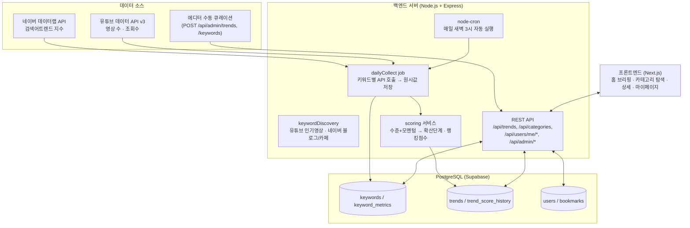
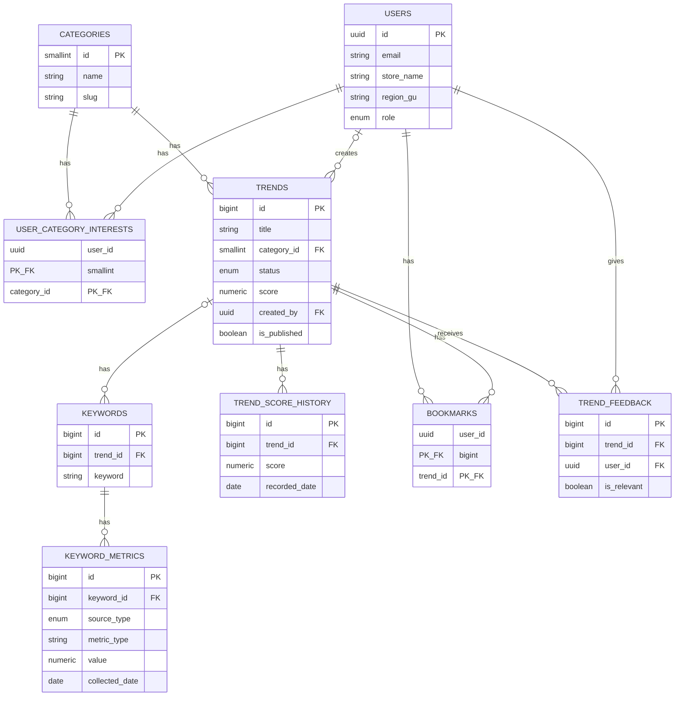

# zuki

카페·베이커리 트렌드 큐레이션 웹앱 **트렌드픽 (TrendPick)** — 자유 주제 팀 프로젝트 (2인 1팀)

---

## 팀원

| 이름 | 학교 | GitHub | 역할 |
|---|---|---|---|
| 김규민 | KAIST | https://github.com/rbalskim | 백엔드 |
| 안소희 | 부산대학교 | https://github.com/soheean1370 | 프론트엔드 |

---

## 기획안

- **산출물 주제:** 카페·베이커리 트렌드 큐레이션 웹앱 **트렌드픽 (TrendPick)**
- **제작 목적:** 카페·베이커리 사장님들은 트렌드에 뒤처지지 않으려 인스타그램을 뒤지지만, 팔로우할 계정이 너무 많고 무엇이 "진짜 트렌드"인지 알고리즘 속에서 판단하기 어렵다. 릴스·해시태그 같은 익숙하지 않은 인터페이스로 정보를 탐색하는 것 자체가 피로하고, 트렌드를 알아도 유행이 지난 뒤에야 알게 되는 경우가 많다. 트렌드픽은 이 정보를 **대신 수집·정리·해석**해서, 사장님이 "볼 것만 보고 바로 판단"할 수 있게 만드는 걸 목표로 한다.
- **핵심 구현 요소:**

    **[홈 / 트렌드 브리핑]**
    - 이번 주 뜨는 디저트·음료·마케팅 카드 뉴스
    - 트렌드별 확산 단계 표시: 태동기 → 상승기 → 전성기 → 하락기
    - 3줄 이내 요약 우선, 카드형 콘텐츠

    **[트렌드 예측]**
    - 검색량·영상 언급량 증가 추이 기반 "다음 달 뜰 것 같은" 항목 선제 안내
    - "왜 뜨는지" 배경 설명 (계절, 해외 유행 유입, 유명인 노출 등)

    **[카테고리 탐색]**
    - 디저트(빵류 포함) / 음료 / 마케팅 3개 카테고리별 필터링

    **[즐겨찾기 / 관심 카테고리]**
    - 마음에 드는 트렌드 카드 즐겨찾기
    - 관심 카테고리 설정해서 홈 피드 커스터마이징

    **[관리자 / 에디터 큐레이션]**
    - 트렌드 카드 수동 등록·발행, 키워드 등록 및 수집 대상 지정
    - 네이버 데이터랩·유튜브 API 데이터 + 에디터 판단을 합쳐 트렌드 점수 산출

- **사용 시나리오:**
  - **김미경 사장님 — 동네 개인 카페 8년 차 운영자 (52세)**
    - 상황: 카카오톡, 인스타그램 피드 보기는 가능하나 릴스·해시태그 탐색은 서툼. 최근 프랜차이즈·신상 카페에 손님을 뺏기는 느낌을 받는 중
    - Pain Point: 정보는 많은데 정리가 안 되고, 유행이 지나서야 알게 됨. 나름 트렌드를 따라가려 노력하지만 그 과정에서 심리적 부담과 스트레스를 많이 느낌
    - 원하는 것: "지금 뭐가 유행인지 한눈에" 확인하고 싶음. 다만 매장에 어떻게 적용할지는 본인이 직접 판단하고 싶어함(→ 그래서 매장 맞춤 추천·적용 가이드 기능은 의도적으로 제외, "유행 정보 제공"까지만 서비스 범위로 한정)
      → 홈 브리핑 + 트렌드 예측 + 카테고리 탐색 기능의 핵심 사용자

- **팀원별 역할:**
  - 김규민: 백엔드 개발, API 연동·데이터 수집 배치
  - 안소희: 기획/UX 설계, 프론트엔드 개발

### 개발 일정 (7일 스프린트)

| Day | 목표 |
|---|---|
| Day 1 | 기획 확정, DB 스키마 설계, 네이버/유튜브 API 키 발급, 프로젝트 초기 세팅 |
| Day 2 | 백엔드 API 골격 구현, 네이버/유튜브 API 연동 스크립트 개발 |
| Day 3 | 데이터 수집 배치 완성 + 트렌드 스코어링 로직 구현 |
| Day 4 | 프론트엔드 홈/카테고리 화면 개발, 백엔드 API 연결 |
| Day 5 | 프론트엔드 트렌드 상세/마이페이지 화면 개발, 관리자(Admin) 최소 기능 구현 |
| Day 6 | 통합 테스트, 버그 수정, 배포 |
| Day 7 | 최종 점검, 발표 자료·시연 시나리오 준비 |

---

## 구현 명세서

| 구현 요소 | 설명 | 우선순위 |
|---|---|---|
| 홈 트렌드 브리핑 | 발행된 트렌드를 카드 리스트로 표시, 확산 단계 라벨 포함 | 필수 |
| 카테고리 탐색 | 디저트/음료/마케팅별 필터링 | 필수 |
| 트렌드 상세 | 검색량 추이 그래프 + "왜 뜨는지" 배경 설명 | 필수 |
| 즐겨찾기 | 트렌드 카드 저장/해제 | 필수 |
| 네이버 데이터랩 연동 | 키워드 검색어트렌드 지수 수집 | 필수 |
| 유튜브 데이터 API 연동 | 키워드 관련 영상 수·조회수 수집 | 필수 |
| 트렌드 스코어링 | 네이버·유튜브 증감률 + 에디터 가중치 기반 점수 계산, 확산 단계 자동 분류 | 필수 |
| 수집 배치 자동화 | 매일 새벽 3시 자동 수집 (node-cron) | 필수 |
| 관리자 API (트렌드/키워드 등록) | 에디터가 트렌드 카드·수집 대상 키워드 직접 등록 | 필수 |
| 관심 카테고리 설정 | 사용자별 관심 카테고리 등록, 홈 피드 커스터마이징 | 선택 |
| 트렌드 예측 | 상승 조짐 있는 트렌드 사전 안내 | 선택 |
| 지역별 트렌드 확산 정보 | 트렌드별 주요 확산 지역 태깅 | 선택 |
| 사용자 제보/투표 | "우리 동네에도 뜨나요?" 피드백 수집 | 선택 |
| 관리자 전용 화면(UI) | 백엔드 데모 페이지(`/demo.html`)에서 트렌드·키워드 등록, 발행, 수집 실행 가능 | 선택 |
| Supabase Auth 로그인 | 지금은 `x-user-id` 헤더로 임시 인증 중 | 선택 |
| 프리미엄 구독/제휴 발주 | 3단계 이후 비즈니스 모델 | 선택 |

---

## 아키텍처

### 데이터 파이프라인 구조도



**수집은 2단계로 나뉜다** — 유튜브 할당량이 네이버보다 훨씬 빡빡하기 때문:

| 단계 | 대상 | 사용 API | 한도 |
|---|---|---|---|
| 넓게 감시 | 후보 키워드 전체 | 네이버만 (5개씩 묶음 호출) | 하루 5,000개까지 가능 |
| 깊게 추적 | 트렌드 카드에 연결된 키워드 | 네이버 + 유튜브 | 하루 ~80개 (키워드당 101 unit) |

후보 키워드는 검색량만 봐도 "뜨는지"는 충분히 판단되므로, 비싼 유튜브 호출은 실제 카드로 만든 것에만 쓴다.

**후보 키워드는 어디서 오나** — 네이버 데이터랩은 "이 키워드가 얼마나 뜨나?"에만 답하고 "뭐가 뜨나?"는 알려주지 않는다. 키워드를 먼저 줘야 지수를 돌려주는 구조이고, 급상승 키워드 목록 API도 없다(실시간 검색어는 2021년 폐지). 그래서 **지금 실제로 올라오고 있는 콘텐츠를 읽어** 후보를 찾아내는 발굴 단계(`POST /api/admin/keywords/discover`)를 별도로 둔다:

1. **네이버 블로그** 최신 포스트 제목
2. **네이버 카페글** 최신 포스트 제목
3. **유튜브 주제 검색** — 최근 30일 영상을 조회수 속도 순으로

검색어는 `카페 신메뉴`, `요즘 유행 디저트`, **`편의점 신메뉴`** 등이다. 편의점을 포함하는 이유는 국내 디저트·음료 유행이 편의점에서 먼저 터지고 카페로 넘어오는 경우가 많기 때문이다(두바이초콜릿이 대표적). 카페 쪽만 보면 이미 확산된 뒤에야 잡힌다.

### 교차 검증 — 편향을 어떻게 다루나

**어떤 발굴 소스도 편향이 있다.** 네이버 블로그는 체험단·협찬 포스팅이 많고, 카페글은 카페마다 연령대가 갈리며, 유튜브는 채널 구독자층이 다르다. 특정 유튜버를 골라 넣는 방식은 고르는 사람의 취향까지 더해져 더 나쁘다.

그래서 두 가지로 완화한다:

**1. 세 소스를 각각 훑고, 몇 곳에서 잡혔는지 센다.** 한 곳에서만 나온 키워드는 그 소스의 편향일 수 있고, 여러 곳에서 동시에 나오면 실제 트렌드일 확률이 높다. 개인 카페·빵집 이름(`천하제빵`, `미켈란젤라또`)이 대개 블로그 한 곳에서만 나온다는 점에서, 이 방식은 가게 이름 노이즈도 함께 걸러준다.

**2. 유튜브는 채널을 고정하지 않는다.** 매번 주제 검색으로 "지금 이 주제에서 조회수가 잘 나오는 영상"을 찾으면 영향력 있는 채널이 자연스럽게 뽑히고, 유행이 바뀌면 구성도 알아서 바뀐다.

구조상 소스 편향이 덜 치명적인 이유도 있다. 발굴은 후보를 찾는 단계일 뿐이고 **최종 판단은 검색량이 한다.** 편향된 소스에서 나온 후보라도 사람들이 실제로 검색하지 않으면 걸러진다. 즉 소스 편향은 "틀린 걸 올리는" 위험보다 "있는 걸 놓치는" 위험을 만든다.

남는 한계는 인정한다 — 우리 소스 대부분이 30~50대 중심이라 20대에서 먼저 뜨는 트렌드는 늦게 잡히고, 수도권 콘텐츠가 많으며, 협찬 포스팅을 완전히 걸러내지는 못한다.

### 조회수는 절대값이 아니라 속도로 본다

```
영상 A: 100만 조회 / 3년 전 업로드  ->  하루 900회
영상 B:   5만 조회 / 5일 전 업로드  ->  하루 1만회   <- 이게 지금 유행
```

`order=viewCount`로만 뽑으면 A가 1등이 되어 "역대 인기"를 재게 된다. `publishedAfter`로 최근 30일 영상만 대상으로 삼고 `조회수 / 업로드 후 경과일`을 계산해야 현재 열기를 잰다.

두 소스 모두 제목에서 "라떼·케이크·크루아상 등으로 끝나는 단어"를 골라내되, **등장 횟수를 함께 센다.** 단순히 중복 제거만 하면 제목 1000개에서 30번 나온 `두바이초콜릿`과 1번 나온 `식빵`이 똑같이 후보 1개가 되어, 결과가 "요즘 화제"가 아니라 "어디에나 있는 메뉴 목록"이 되어버린다.

추출 과정에서 걸러내는 것들:

- **가게·프랜차이즈 이름** — `천하제빵`, `더벤티`처럼 형태 단어로 끝나지만 메뉴가 아니다. 사장님이 알고 싶은 건 가게 이름이 아니라 그 가게에서 뜨는 디저트다.
- **지역명** — `창원소금빵` → `소금빵`으로 정규화하고, `서울빵`처럼 벗기면 형태 단어만 남는 건 버린다.
- **짧은 형태 단어** — `빵`, `티`는 가게 이름에도 흔해서(`탄티`) 앞에 붙는 말이 2자 이상일 때만 인정한다.

형태소 분석기 없이 처리하는 방식이라 정밀하진 않지만, 오탐이 나와도 다음 단계에서 검색량으로 다시 걸러진다.

**후보 순위는 변화의 크기로 매긴다.**

```
trend_signal = 변화 강도(방향 무관) 55점 + 검색지수 30점 + 교차검증 15점
```

**증감률을 절댓값으로 쓴다.** 부호를 그대로 쓰면 하락 중인 키워드가 항상 최하위로 깔려 "지난 유행" 카드가 만들어지지 않는다. 크게 오르든 크게 내리든 많이 움직인 것은 알릴 가치가 있고, 방향은 확산 단계가 표현한다. 덕분에 상승·하락 트랙을 따로 둘 필요가 없다.

검색지수를 정렬 기준에 넣으면 에그타르트·밀크티 같은 스테디셀러가 상위를 차지해 발굴이 되지 않는다. 검색지수가 높다는 건 이미 자리잡았다는 뜻이기 때문이다.

**언급 증가율에 더 무게를 두는 이유** — 새로 뜨는 메뉴는 검색량보다 블로그 게시가 먼저 늘어난다. 사람들이 검색하기 전에 글부터 올라오기 때문이다.

**언급 증가율은 어떻게 구하나** — 네이버 블로그 검색 응답에 `postdate`(게시 날짜)가 들어온다. 최신순으로 긁어 날짜별로 세면 일별 게시량이 나오고, `start` 파라미터로 최대 1,000개까지 거슬러 올라갈 수 있다. 덕분에 **과거 데이터를 쌓아두지 않아도 "최근 7일 대 그 이전 7일"을 오늘 바로 계산할 수 있다.**

### 계절성 보정

7월에 팥빙수 검색이 오르는 건 트렌드가 아니라 여름이라서다. 최근 7일 대 이전 7일만 비교하면 이런 계절 메뉴가 전부 "상승 중"으로 잡힌다.

그래서 데이터랩을 `timeUnit=month`로 24개월치 조회해 **작년 같은 달과 비교한다.** 작년에도 비슷한 수준이었다면(올해의 70% 이상) 매년 반복되는 계절 메뉴로 보고 후보에서 제외한다. `yoy_growth_rate`(전년 동월 대비 증감률)가 클수록 올해 새로 뜨는 것이다.

**후보에서 걸러내는 조건 정리**

| 조건 | 이유 |
|---|---|
| 검색지수 5 미만 | 아무도 안 찾는 것. 정렬엔 안 쓰되 하한선은 둔다 |
| 검색지수 40+ & 검색 증감률 5% 미만 | 이미 자리잡은 상시 메뉴 |
| 언급 2회 미만 | 대부분 가게 이름이나 일회성 표현 |
| 작년 같은 달에도 비슷하게 높았음 | 계절성 반복 (7월의 팥빙수) |

**측정이 불가능하면 값을 만들어내지 않는다.** 언급 증가율은 14일 구간을 실제로 덮었고 표본이 10건 이상일 때만 낸다. 인기 키워드는 블로그 글 1,000건(API 상한)이 며칠치밖에 안 돼 이전 7일에 도달하지 못하는데, 그 경우 "무한 증가"처럼 보이지만 사실은 데이터가 없는 것이다. 글 5건으로 계산한 `+66.7%`도 노이즈다. 전년 대비도 작년 지수가 1 미만이면(`+116343%` 같은 값이 나온다) 계산하지 않는다.

> 초기엔 `재료 × 형태`(흑임자 + 라떼) 조합을 자동 생성했지만 폐기했다. 우리가 만들어낸 말은 대부분 아무도 검색하지 않고, 진짜 유행어(두바이초콜릿 같은)는 조합으로 예측할 수 없기 때문이다.

### 카드 생성 — 자동, 다만 지어내지 않는다

`POST /api/admin/trends/auto-refresh`가 수집한 키워드를 **트렌드 카드로 자동 생성**한다.

**카드는 "지금 뜨는 것"이 아니라 감시 중인 디저트 전체의 카탈로그다.** 그 안에서 확산 단계로 나뉘고, 홈 화면은 `sort=score&limit=10`으로 상위 몇 개만 보여준다. 순위에서 밀렸다고 카드를 내리지 않는다 — 단계가 하락기로 바뀔 뿐이라 지난 유행을 계속 보여줄 수 있다.

**비용과 시간 때문에 2단계로 나눈다.** 카드마다 근거 수집(네이버 검색 2회) + LLM 문구 + AI 이미지를 돌리면 카드당 10~15초가 걸리고 이미지는 장당 과금된다. 수백 개를 한 요청에 처리하면 HTTP가 먼저 끊긴다.

| | 문구 | 이미지 | 속도 |
|---|---|---|---|
| 상위 15개 | 뉴스·블로그 근거 + LLM | AI 생성 | 카드당 10~15초, 과금 |
| 나머지 | 측정값 기반 | 없음 | 즉시, 무료 |

그리고 한 번에 다 만들지 않고 매 실행마다 상한만큼만 만든 뒤 남은 개수를 응답에 담는다. 0이 될 때까지 여러 번 실행하면 밀린 만큼 채워진다.

문구 자동 생성에는 환각 위험이 있다. "왜 뜨는지"를 LLM에게 자유롭게 맡기면 *"최근 일본 디저트 유행과 맞물려..."* 같은 그럴듯한 거짓말이 나오는데, 사장님이 이걸 근거로 메뉴를 결정하면 곤란하다.

그래서 **실제 게시물을 읽어와 그 안에 있는 내용만 쓰게 한다.** 키워드마다 네이버 뉴스·블로그를 검색해 제목과 본문 발췌를 모으고, LLM에는 그 자료와 우리가 측정한 수치만 준다. 뉴스에는 배경(신제품 출시, 화제성)이 적혀 있는 경우가 많아, LLM이 하는 일은 창작이 아니라 요약이 된다. 게시물에 원인이 없으면 추측하지 말고 지표만 서술하게 한다.

```
X "최근 일본 디저트 유행과 맞물려"        <- 아무 자료에도 없는 창작
O "편의점 3사가 이달 신제품으로 출시했고"  <- 뉴스 기사에 실제로 있는 내용
O "최근 7일 블로그 게시량이 2배 늘었습니다" <- 우리가 측정한 값
```

근거가 된 게시물 링크는 카드의 `evidence` 필드에 저장해 **사장님이 원문을 확인할 수 있게** 한다. 출처를 못 대는 정보는 트렌드 서비스에서 신뢰받을 수 없기 때문이다.

- 배치(`dailyCollect`)가 외부 API에서 원시 데이터를 가져와 `keyword_metrics`에 쌓고, 스코어링 로직이 증감률을 계산해 `trends.score`/`trend_score_history`를 갱신한다.
- 프론트엔드는 가공이 끝난 결과(`/api/trends` 등)만 조회한다 — 외부 API를 직접 호출하지 않아 네이버·유튜브 API 할당량을 절약한다.
**확산 단계는 수준 + 모멘텀 2차원으로 분류한다.**

| | 감소 (−15%↓) | 정체 | 급등 (+50%↑) |
|---|---|---|---|
| 검색지수 40 이상 | 하락기 | 전성기 | 상승기 |
| 검색지수 15~40 | 하락기 | 상승기 | 상승기 |
| 검색지수 5~15 | 하락기 | 태동기 | 태동기 |
| 검색지수 5 미만 | 태동기 | 태동기 | 태동기 |

증감률만으로 단계를 정하면 분류가 뒤집힌다 — 전성기는 원래 "이미 높은 수준에서 정체"라 증감률이 0에 가깝고, 태동기는 "밑바닥에서 시작"이라 증감률이 폭발적이기 때문이다. 검색지수 5→10인 무명 키워드가 +100%로 전성기가 되고, 80→90인 성숙 트렌드가 +12%로 태동기가 되는 식이다. 그래서 크기(수준)와 방향(모멘텀)을 함께 본다.

랭킹 점수는 이와 별개로 `검색지수 × 0.6 + 증감률(정규화) × 0.4`로 계산한다. 사장님이 알고 싶은 건 "비율상 많이 오른 것"이 아니라 "실제로 큰 유행"이므로 수준에 더 무게를 둔다.

**증감률은 최근 7일 평균 대 그 이전 7일 평균으로 계산한다.** 카페 디저트 검색은 주말에 몰려서, 하루 단위 비교는 월요일과 일요일을 견주게 되어 항상 급락처럼 보인다. 이동평균은 요일 효과를 상쇄하고 특정 하루의 이상치도 흡수한다. 14일치가 필요하지만 네이버가 3개월 시계열을 통째로 주므로 첫 실행부터 계산할 수 있다.

- 스코어링은 통계·ML 모델 대신 단순 규칙을 쓴다. 초기 데이터가 적은 상태에서 복잡한 모델은 오히려 부정확해지기 쉽고, 사장님 대상 서비스라 "왜 이 등급인지" 설명 가능해야 신뢰를 얻는다는 판단.

---

## 설계 문서

### 화면 / 인터페이스 설계

<!-- 프론트엔드 화면 설계/Figma 링크는 안소희님이 채워주세요 -->
(작성 예정)

### 데이터 구조

**트렌드픽 DB ERD**



전체 DDL: [`backend/src/db/schema.sql`](./backend/src/db/schema.sql)

### API / 외부 서비스 연동

| Method | Endpoint | 설명 | 요청 | 응답 |
|---|---|---|---|---|
| GET | `/health` | 헬스체크 | - | `{ status, service, time }` |
| GET | `/api/categories` | 카테고리 목록 | - | `{ categories: [...] }` |
| GET | `/api/trends` | 발행된 트렌드 목록 | 쿼리 `category`, `status`, `limit` | `{ trends: [...] }` |
| GET | `/api/trends/:id` | 트렌드 상세 + 스코어 추이 | - | `{ trend, scoreHistory }` |
| GET | `/api/users/me/bookmarks` | 즐겨찾기 목록 | Header `x-user-id` | `{ bookmarks: [...] }` |
| POST | `/api/users/me/bookmarks/:trendId` | 즐겨찾기 추가 | Header `x-user-id` | `{ ok: true }` |
| DELETE | `/api/users/me/bookmarks/:trendId` | 즐겨찾기 해제 | Header `x-user-id` | `204` |
| PUT | `/api/users/me/category-interests` | 관심 카테고리 설정 | `{ categoryIds: number[] }` | `{ ok, categoryIds }` |
| POST | `/api/admin/trends` | 트렌드 카드 생성(초안) | `{ title, categoryId, summary?, reason?, ... }` | `{ trend }` |
| PATCH | `/api/admin/trends/:id/publish` | 트렌드 발행 | - | `{ trend }` |
| POST | `/api/admin/keywords` | 키워드 등록/트렌드 연결 | `{ keyword, trendId? }` | `{ keyword }` |
| GET | `/api/admin/keywords` | 키워드 목록 | - | `{ keywords: [...] }` |
| POST | `/api/admin/collect` | 수집 배치 즉시 실행 | - | `{ summary }` |
| REST (외부) | 네이버 데이터랩 검색어트렌드 API | 키워드 검색량 상대지수(0~100) 조회, 최대 5그룹×20개 검색어 | `X-Naver-Client-Id/Secret` 헤더 | 기간별 지수 시계열 |
| REST (외부) | 유튜브 데이터 API v3 (`search.list`, `videos.list`) | 키워드 관련 영상 수·조회수 조회. 일일 10,000 unit 한도(`search.list` 100 unit) | API Key 쿼리 파라미터 | 영상 목록/통계 |

요청/응답 예시 전체: [`backend/API.md`](./backend/API.md)

---

## 산출물 및 실행 방법

- **산출물 설명:** 카페·베이커리 사장님을 위한 트렌드 큐레이션 웹앱. Next.js 프론트엔드 + Express 백엔드 + Supabase(PostgreSQL) 구성.
- **실행 환경:** 웹 브라우저 (반응형, 모바일/PC 대응). 백엔드는 Node.js 서버.
- **배포:** Render(백엔드, 무료 플랜) + Supabase(DB) / Vercel(프론트엔드, 예정)

### 실행 방법

레포는 `frontend`(Next.js) · `backend`(Express) 2개로 구성되어 있어 각자 의존성을 설치하고 실행해야 한다.

```bash
# 1) 백엔드 (backend/)
cd backend
npm install
cp ../.env.example .env   # 값 채워넣기: DATABASE_URL, NAVER_CLIENT_ID/SECRET, YOUTUBE_API_KEY
npm run dev                # http://localhost:4000

# DB 스키마 적용 (최초 1회, Supabase 프로젝트 기준)
psql "$DATABASE_URL" -f backend/src/db/schema.sql

# 2) 프론트엔드 (frontend/)
cd frontend
npm install
npm run dev                # http://localhost:3000
```

> `.env`는 `backend/.env`에 실제 값을 넣어야 한다 — `.env.example`은 git에 커밋되는 템플릿이라 실제 키/비밀번호를 넣으면 안 됨.
> Supabase 무료 티어는 direct connection이 IPv6 전용이라, `DATABASE_URL`은 대시보드 Connect → **Session pooler** 연결 문자열을 사용해야 함.

### 배포 주소

| 대상 | 주소 |
|---|---|
| 백엔드 API | https://zuki-l2hu.onrender.com |
| 백엔드 데모 페이지 | https://zuki-l2hu.onrender.com/demo.html |
| 헬스체크 | https://zuki-l2hu.onrender.com/health |
| 프론트엔드 | (Vercel 배포 예정) |

프론트엔드는 `.env`에 `NEXT_PUBLIC_API_URL=https://zuki-l2hu.onrender.com`을 넣으면 배포된 백엔드에 붙는다.

### 백엔드 배포 (Render)

레포 루트의 [`render.yaml`](./render.yaml)에 설정이 들어있다. Render 대시보드에서 **New → Blueprint**로 이 레포를 연결하면 그대로 서비스가 만들어진다.

| 항목 | 값 |
|---|---|
| Root Directory | `backend` |
| Build Command | `npm ci && npm run build` |
| Start Command | `npm start` |
| Health Check Path | `/health` |
| Plan | Free |

**대시보드에서 직접 입력해야 하는 환경변수** (시크릿이라 `render.yaml`엔 값이 없음):

| 변수 | 설명 |
|---|---|
| `DATABASE_URL` | Supabase **Session pooler** 연결 문자열. 비밀번호의 특수문자는 URL 인코딩 필요 |
| `NAVER_CLIENT_ID` / `NAVER_CLIENT_SECRET` | 네이버 데이터랩 API |
| `YOUTUBE_API_KEY` | 유튜브 데이터 API v3 |
| `CORS_ORIGIN` | 프론트 배포 도메인 (예: `https://trendpick.vercel.app`). 미설정 시 전체 허용 |

배포 후 `https://<서비스명>.onrender.com/health`로 확인하고, 프론트의 API base URL을 이 주소로 바꾸면 된다.

> **무료 플랜 슬립 주의**
> 15분간 요청이 없으면 인스턴스가 잠들고, 다음 요청이 깨우는 데 약 1분 걸린다.
> 시연 중 첫 요청이 1분 대기하게 되므로, 발표 직전에 미리 한 번 열어두는 것이 좋다.

### 수집 배치 자동화

수집 배치는 `node-cron`으로 매일 새벽 3시에 실행되도록 등록돼 있다(`DAILY_COLLECT_CRON`).
다만 **cron은 서버 프로세스가 살아있을 때만 동작**하기 때문에, 두 환경 모두에서 그대로는 자동 실행이 보장되지 않는다:

- **로컬** — `npm run dev`를 켜둔 동안에만 돌아감
- **Render 무료** — 15분 미사용 시 슬립되어 프로세스가 내려감

그래서 **외부 스케줄러가 하루 한 번 수집 API를 호출**하는 방식을 함께 쓴다. 이 호출이 잠든 인스턴스를 깨우면서 수집까지 수행하므로 슬립 문제가 같이 해결된다.

**설정 방법** ([cron-job.org](https://cron-job.org) 기준, 무료)

| 항목 | 값 |
|---|---|
| URL | `https://<서비스명>.onrender.com/api/admin/collect` |
| Method | `POST` |
| Schedule | 매일 03:00 |
| Header | `x-collect-secret: <COLLECT_SECRET 값>` |
| Timeout | 넉넉하게 (수집에 수십 초 걸림) |

`COLLECT_SECRET`은 `render.yaml`에서 Render가 자동 생성하므로, 배포 후 대시보드 → Environment에서 값을 복사해 위 헤더에 넣으면 된다.

> **왜 보호가 필요한가**
> 이 API는 호출될 때마다 네이버·유튜브 API를 실제로 호출한다. 열어두면 누군가 반복 호출해 유튜브 일일 할당량(10,000 unit)을 소진시킬 수 있다.
> `COLLECT_SECRET`이 설정돼 있으면 `x-collect-secret` 헤더가 일치할 때만 실행되고, 비어 있으면 기존처럼 누구나 호출 가능하다(로컬 개발 편의).

### 백엔드 데모 페이지

프론트엔드 없이 백엔드만으로 시연·테스트할 수 있는 페이지가 포함되어 있다.
백엔드 실행 후 **http://localhost:4000/demo.html** 접속:

- **공개 API 탭** — 트렌드 피드 조회(카테고리/확산단계/개수 필터), 트렌드 상세 + 스코어 추이, 즐겨찾기 추가·해제·목록, 관심 카테고리 설정
- **관리자 API 탭** — 트렌드 카드 등록 → 발행, 수집 대상 키워드 등록·조회, 네이버·유튜브 수집 배치 즉시 실행

Express가 같은 오리진(`backend/public/`)에서 서빙하므로 별도 설정 없이 바로 열린다.
`x-user-id`(임시 인증 헤더)는 페이지가 UUID를 자동 생성해 `localStorage`에 보관한다.

> 수집 배치 실행은 키워드마다 네이버·유튜브 API를 실제로 호출한다 — 수십 초 걸릴 수 있고 유튜브 할당량(키워드당 101 unit / 하루 10,000)을 소모하니 시연 직전에 남발하지 말 것.

### 기술 구성

| 분류 | 사용 기술 |
|---|---|
| 프론트엔드 | Next.js(React), TypeScript, Tailwind CSS, React Query + Zustand |
| 백엔드 | Node.js, Express, TypeScript |
| 데이터베이스 | PostgreSQL (Supabase) |
| 배치/스케줄링 | node-cron |
| 외부 API | 네이버 데이터랩 검색어트렌드 API, 유튜브 데이터 API v3 |
| 배포 | Render(백엔드), Supabase(DB), Vercel(프론트, 예정) |

---

## 회고 문서

> 프로젝트 진행 중 — 스프린트 종료 후 KPT로 작성 예정

### Keep

(작성 예정)

### Problem

(작성 예정)

### Try

(작성 예정)

### 팀원별 소감

**김규민:**

> (작성 예정)

**안소희:**

> (작성 예정)

---

## 참고 자료

- [네이버 개발자센터 — 데이터랩 API](https://developers.naver.com)
- [YouTube Data API v3 문서](https://developers.google.com/youtube/v3)
- [Supabase — Connect to your database](https://supabase.com/docs/guides/database/connecting-to-postgres)
